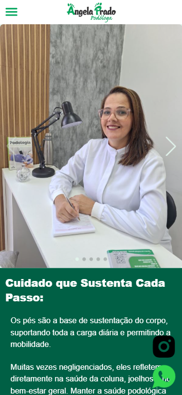

🦶 Landing Page – Ângela Prado Podóloga

Este projeto é uma landing page institucional desenvolvida para a profissional Ângela Prado Podóloga, com o objetivo de apresentar seus serviços, sua história profissional e facilitar o contato com clientes.

A página foi pensada para ser simples, responsiva e direta, funcionando bem tanto no celular quanto no computador.

📸 Preview do Projeto

🚀 Funcionalidades

✅ Seção apresentando a importancia da podologia

✅ Seção "Sobre" com informações da profissional

✅ Área de contato com informações para atendimento

✅ Botões flutuantes fixos na tela para:

WhatsApp

Instagram

✅ Layout responsivo (mobile e desktop)

✅ Interface limpa e focada na conversão de contato

## 🛠️ Tecnologias Utilizadas

- React  
- TypeScript  
- Tailwind CSS  
- Swiper (carrossel)  
- React Router DOM (SPA e rotas)  
- Animate.css (animações)

▶️ Como rodar o projeto localmente

# Clone o repositório
git clone https://github.com/EderMinotti/angela-prado-landing.git

# Entre na pasta do projeto
cd angela-prado-landing

# Instale as dependências
npm install

# Rode o projeto
npm run dev

Este projeto foi criado com foco em:

Praticar criação de layouts responsivos

Organização de componentes no React

Uso do Tailwind CSS para estilização

Construção de uma landing page realista para portfólio

👨‍💻 Autor

Desenvolvido por Eder Paulo Minotti

📄 Licença

Este projeto é apenas para fins educacionais e de portfólio.
